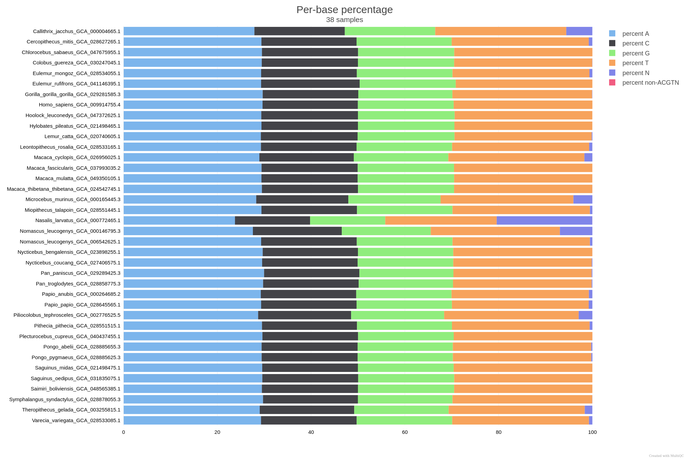
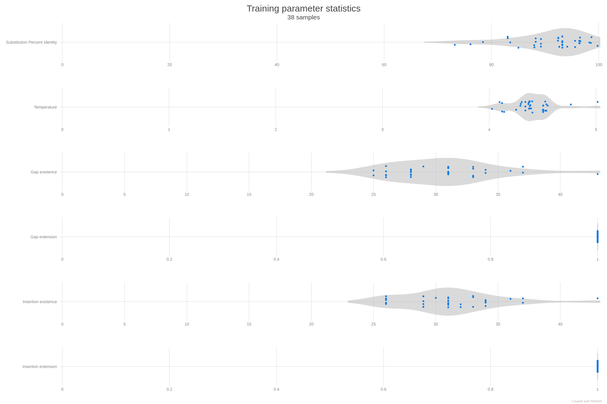
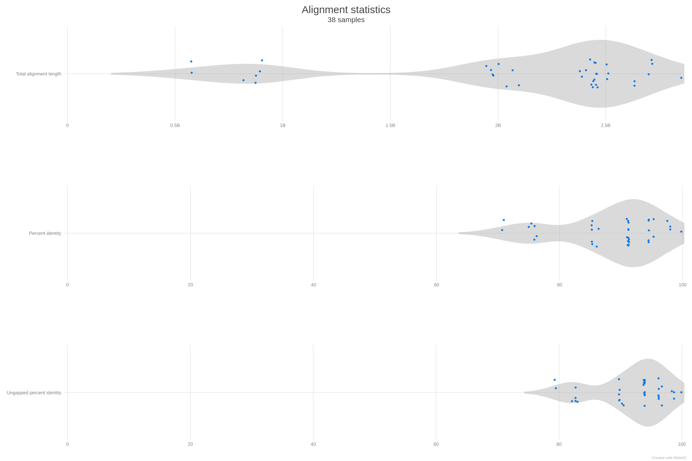

# nf-core/pairgenomealign: Output

## Introduction

This document describes the output produced by the pipeline.

The directories listed below will be created in the results directory after the pipeline has finished. All paths are relative to the top-level results directory.

## Pipeline overview

The pipeline is built using [Nextflow](https://www.nextflow.io/) and processes data using the following steps:

- [Alignments](#alignments) - Alignment of the _query_ genomes to the _target_ genome
- [Dot plots](#dot-plots) - Visualisation of the alignment of the _query_ genomes to the _target_ genome
- [`N` regions](#n-regions) - Coordinate of the `N` regions on the _query_ and _target_ genomes
- [MultiQC](#multiqc) - Aggregate report describing results and QC from the whole pipeline
- [Pipeline information](#pipeline-information) - Report metrics generated during the workflow execution

Each _query_ genome, is aligned to the _target_ genome, and each alignment is visualised with dot plots. The output file names are constructed by concatenating the _target_ and _query_ sample identifiers with a `___` separator (three underscores), to faciliate re-extraction of the IDs from file names.

### Assembly statistics

Output files

- `assemblyscan/`
  - `*.json` contains the statistics collected with the [`assembly-scan`](https://github.com/rpetit3/assembly-scan) software.

Basic statistics on nucleotide content and contig length are collected for aligned genome for later plotting with MultiQC.

### Alignments

Output files

- `alignment/`
  - `*.train` is the alignment parameters computed by `last-train` (optional)
  - `*.m2m_aln.maf.gz` is the _**many-to-many**_ alignment between _target_ and _query_ genomes. (optional through the `--m2m` option)
  - `*.m2o_aln.maf.gz` is the _**many-to-one**_ alignment regions of the _target_ genome are matched at most once by the _query_ genome. (optional through the `--m2m` option)
  - `*.o2m_aln.maf.gz` is the _**one-to-many**_ alignment between the _target_ and _query_ genomes. (optional through the `--m2m` option)
  - `*.o2o_aln.maf.gz` is the _**one-to-one**_ alignment between the _target_ and _query_ genomes.
  - For each MAF file there will be an additional file in a format such as Axt, Chain, GFF or SAM if you used the `--export_aln_to` parameter. These files are always compressed.

Genomes are aligned witn [`lastal`](https://gitlab.com/mcfrith/last/-/blob/main/doc/lastal.rst) after alignment parameters have been determined with [`last-train`](https://gitlab.com/mcfrith/last/-/blob/main/doc/last-train.rst). _**Many-to-many**_ alignments are progressively converted to _**one-to-one**_ with [`last-split`](https://gitlab.com/mcfrith/last/-/blob/main/doc/last-split.rst).

### Dot plots

Output files

- `alignment/`
  - `*.m2m_plot` (optional)
  - `*.m2o_plot` (optional)
  - `*.o2o_plot` (optional)
  - `*.o2m_plot` (optional)

Dot plots representing the pairwise genome alignments, produced with the [`last-dotplot`](https://gitlab.com/mcfrith/last/-/blob/main/doc/last-dotplot.rst) tool. In the one-to-one alignment example below, the `hg38` human genome (_target_) is represented on the horizontal axis and a monkey genopme (_Macaca mulatta_ accession number `GCA\_003339765.3`) on the vertical axis (_query_). Regions containing unknown (`N`) sequences are on pink background. Forward (+/+) alignments are plotted in red and reverse (+/– or –/+) in blue. _Target_ (human) contigs are displayed in their original order. _Query_ contigs (monkey) are reordered and possibly reverse-complemented to diagonalise the plot as much as possible. The names of reverse-complemented contigs are printed in blue.

### `N` regions

Output files

- `cutn/`
  - `targetGenome.bed`
  - `<sample>.bed`

The poly-N regions longer than 9 bases in each genome sequence often indicate contig boundaries in scaffolds. Therefore, we marked them in pale red in the dot-plots. They are detected with the`seqtk cutN` command and its output (in 3-column BED format) is provided in the `cutn` directory. Sample IDs are constructed to generate file names, except for the _target_ genome which is always called `targetGenome` to avoid filename collisions.

### MultiQC

Output files

- `multiqc/`
  - `multiqc_report.html`: a standalone HTML file that can be viewed in your web browser.
  - `multiqc_data/`: directory containing parsed statistics from the different tools used in the pipeline.
  - `multiqc_plots/`: directory containing static images from the report in various formats.
  - `assemblyscan_plot_data`: GC content and contig length statistics parsed from `assemblyscan` for MultiQC with a local module.

[MultiQC](http://multiqc.info) is a visualization tool that generates a single HTML report summarising all samples in your project. Most of the pipeline QC results are visualised in the report and further statistics are available in the report data directory.

Results generated by MultiQC collate pipeline QC from supported tools e.g. FastQC. The pipeline has special steps which also allow the software versions to be reported in the MultiQC output for future traceability. For more information about how to use MultiQC reports, see <http://multiqc.info>.

The example MultiQC plots below were generated on this pipeline's full test dataset, which aligns the `hg38` human genome to other primate genomes.

#### Base content

The pipeline reports the base content of every query genome, like in the example below:

#### Contig length statistics

Contig length statistics can be displayed by MultiQC as violin plots.

#### TRaining parameters

Alignment parameters computed by `last-train` can be displayed by MultiQC as violin plots.

#### Alignment

Alignment statistics can be displayed by MultiQC as violin plots.

### Pipeline information

Output files

- `pipeline_info/`
  - Reports generated by Nextflow: `execution_report.html`, `execution_timeline.html`, `execution_trace.txt` and `pipeline_dag.dot`/`pipeline_dag.svg`.
  - Reports generated by the pipeline: `pipeline_report.html`, `pipeline_report.txt` and `software_versions.yml`. The `pipeline_report*` files will only be present if the `--email` / `--email_on_fail` parameter's are used when running the pipeline.
  - Reformatted samplesheet files used as input to the pipeline: `samplesheet.valid.csv`.
  - Parameters used by the pipeline run: `params.json`.

[Nextflow](https://www.nextflow.io/docs/latest/tracing.html) provides excellent functionality for generating various reports relevant to the running and execution of the pipeline. This will allow you to troubleshoot errors with the running of the pipeline, and also provide you with other information such as launch commands, run times and resource usage.
